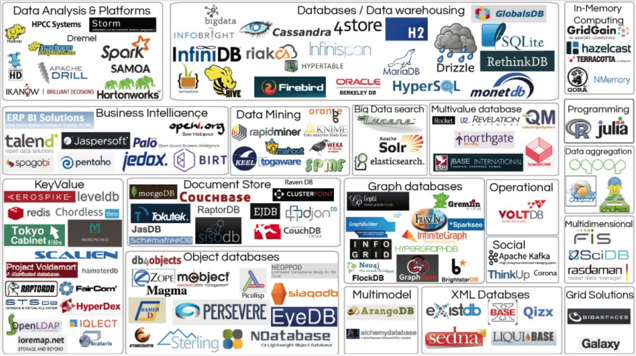

# **Introduction**
## **Definition of Big Data:**  
Big data is a field that treats ways to analyze, systematically extract information from. or otherwise deal with data sets that are too ***large*** or ***complex*** to be dealt with by traditional data-processing application software.
## **Characteristics of Big Data: Vs**  
* Volume (Scale):  A large number of data is being generated every day.
* Variety (Complexity): There are different types of data.
* Velocity (Speed): It measures how fast the data is coming in.
* Veracity: Data quality issues are particularly challenging in a big data context. Data should be cleaned firstly, then be processed.
* Value: Ultimately, big data is meaningless if it does not provide value toward some meaningful goal.
* Visibility (Visualization)
* Variability: Refers to data whose meaning is constantly changing. It defines the need to get meaningful data considering all possible circumstances.
* Viscosity: It is used to describe the latency or lag time in the data relative to the event being described.
* Volatility: Refers to how long is data valid and how long should it be stored.
* And there will be more Vs in the future...

## **Open-Source Tools**

## **Main Tools and Applications covered in this repo**
* Big data management tools:
  * Apache Hadoop:
    * YARN/HDFS/Hive (these will be introduced briefly)
    * MapReduce
    * Spark
    * NoSQL (HBase)
    * Google Dataproc
* Big data typical applications:
  * Finding similar items
  * Graph data processing
  * Data stream mining
  * Link Analysis

## **What's the difference between Hadoop and RDBMS?** (Personal Comprehensionb )
* Hadoop: The server allocate big data to several computers(clients) and store the big data distributively in each computer, the style of storing data is called HDFS(Hadoop Distributed File System). Then, workers use the local distributed data for processing. The server only takes the responsibility of allocating data, it doesn't store data.
* RDBMS: The data is stored in the disk of server, workers who work in client machine uses data through quiring the data in the disk of server. 
   
When comparing with RDBMS, Hadoop is more efficient for dealing with big data.

***
## **Components of Hadoop**
### **Hadoop 1.x**
* **MapReduce:**  for computation and resource allocation;
* **HDFS:** for data storage;
* **Common:** assistant tools.
### **Hadoop 2.x** 
(MapReduce 2.x $\rightarrow$ MapReduce 2.x + Yarn)
* **MapReduce:** only for computation;
* **Yarn:** only for resource allocation (CPU and memory);
* **HDFS:** for data storage;
* **Common:** assistant tools.
### **Hadoop 3.x**
No updates in components part.

***
## **Server and Clients**
### **Server**
* Contains **NameNode**: maintaining the information of data blocks storage situation.
  * NameNode: contains the meta data and each file's block list and their location in DataNode.
* Contains **Secondary NameNode**: provide backup for the meta data of NameNode.

### **Clients**
* Contains **DataNode**
  * DataNode: contains the local meta data and the checksum of blocks.
  
***
## **Architecture of YARN**
* **Resource Manager**: manage the resource of whole system
* **Node Manager**: only manage the resource of local machine
  * **Container**: quite simillar to a lite virtual machine. As long as the task is finished, the computation resource will be free.
    * **Application Master**: takes response for a single task in Container.

***
## **The Eco-System of Big Data Tech**
