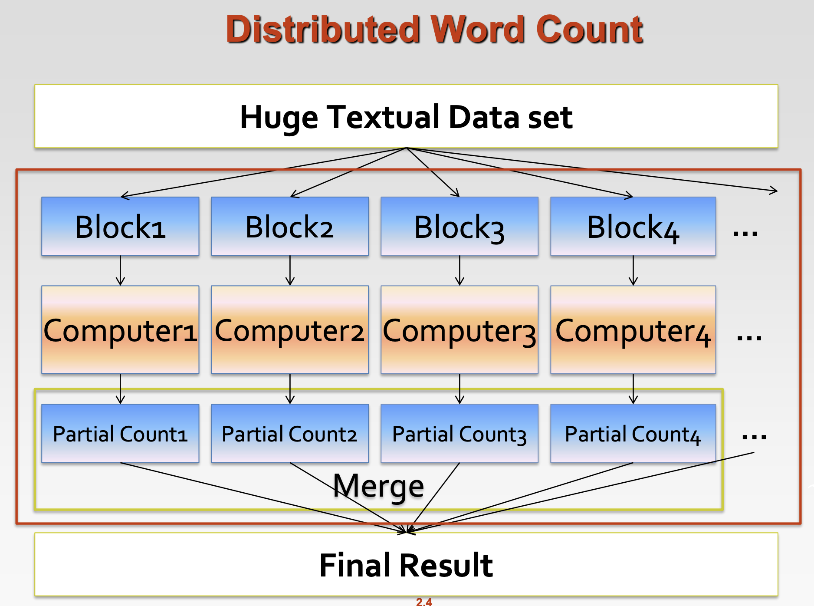

# **MapReduce**
## **Work Flow of Big Data Related**

When specify it in a Word Count task, the flow can be shown as the following figure.

***
## **What is MapReduce?**
* MapReduce is <u>Simplified Data Processing on Large Clusters</u>, origin from Google.
* It is a programming model for parallel data processing.
* Hadoop can run MapReduce programs written in various languages: Java, Ruby, Python, C++, etc.  
  Hadoop is something like a platform of MapReduce and other tools.
* Application: For large-scale data processing
  * Exploits large set of commodity computers
  * Executes process in a distributed manner
  * Offers high availability
***

## **Motivation for MapReduce**
### Typical Big Data problem challenges:
* How do we break up a large problem into smaller tasks that can
be executed in parallel?
* How do we assign tasks to workers distributed across a potentially
large number of machines?
* How do we ensure that the workers get the data they need?
* How do we coordinate synchronization among the different workers?
* How do we share partial results from one worker that is needed by another?
* How do we accomplish all of the above in the face of software errors and hardware faults?

Hence, there was need for an abstraction that hides many system-level details from the programmer.  
<u>MapReduce addresses this challenge by providing a simple
abstraction for the developer, transparently handling most of the details behind the scenes in a **scalable**, **robust**, and **efficient** manner.</u>
***

## **The idea of MapReduce**
Key idea: Provides a functional abstraction for **Map** and **Reduce** operations.
* Iterate over a large number of records  
* Extract something of interest from each ---- **Map Operation**
* Shuffle and sort intermediate result
* Aggregate intermediate results
* Generate final output (e.g. Merge data through pick up the maximum value) --- **Reduce Operation**
* Inspired by the map and reduce functions in functional programming
* We can view map as a transformation over a dataset
  * This transformation is specified by the function $f$
  * Each functional application happens in <u>isolation</u>
  * The application of $f$ to each element of a dataset can be parallelized in a straightforward manner
* We can view reduce as an aggregation operation
  * The aggregation is defined by the function $g$
  * Data locality: elements in the list must be “brought together”
  * If we can group elements of the list, also the reduce phase can proceed in parallel
* The framework coordinates the map and reduce phases:
  * Grouping intermediate results happens in parallel
* Handles scheduling
  * Assigns workers to map and reduce tasks
* Handles “data distribution”
  * Moves processes to data
* Handles synchronization
  * Gathers, sorts, and shuffles intermediate data
* Handles errors and faults
  * Detects worker failures and restarts
* **Everything happens on top of a distributed file system (HDFS)**
* **You don’t know:**
  * Where mappers and reducers run
  * When a mapper or reducer begins or finishes
  * Which input a particular mapper is processing
  * Which intermediate key a particular reducer is proces

***
## **Data Structures in MapReduce**
* **Key-value pairs** are the basic data structure in MapReduce
  * Keys and values can be: integers, float, strings, raw bytes
  * They can also be arbitrary data structures, but **must be comparable (for sorting)**
* The design of MapReduce algorithms involves:
  * Imposing the key-value structure on arbitrary datasets (Which means each key is only related to a single value)
    * E.g.: for a collection of Web pages, input keys may be URLs and values may be the HTML content 
  * In some algorithms, input keys are not used (e.g., wordcount), in others they uniquely identify a record 
  * Keys can be combined in complex ways to design various algorithms.

***
## <u>**Map and Reduce Functions**</u>
* **Map** $(k_1,v_1)\rightarrow list[<k_2,v_2>]$  
  It transforms the input into key-value pairs to process
* **Reduce** $(k_2, list[v_2]\rightarrow [<k_3,v_3>])$  
  It aggregates the list of values for each key. And all values with the same key are sent to the same reducer.

A complex program can be divided into a succession of Map and Reduce tasks.

***
## <u>**Workflow of MapReduce**</u>

## <u>**Workflow of a WordCount Example:**</u>
WordCount is going to count number of each word in documents (e.g. Tweets/Facebooks/Blogs)
* **Reads input pair** <$k_1$, $v_1$>  
  The input to the **mapper** is in the format of <docID, docText>  
  E.g. Input is <D1, "Hello, Worlds">, <D2, "Hello Hadoop Bye Hadoop">
* **Outputs pair** <$k_2$, $v_2$>  
  The output of the **mapper** is in the format of <term, 1>  
  <Hello, 1><World, 1><Hello, 1><Hadoop, 1><Bye, 1><Hadoop, 1>
* After **shuffling and sort**, reducer will receives <$k_2$, list($v_2$)>  
  <Hello, {1, 1}><World, {1}><Hadoop, {1, 1}><Bye, {1}>
* The ultimate **output** is in the format of <$k_3$, $v_3$>

***
## **Shuffle and Sort**
* **Shuffle:**  
Input to the Reducer is the sorted output of the mappers. In this phase the framework fetches the relevant partition of the output of all the mappers, via HTTP.
* **Sort:**  
Mapper sorts the intermediate resutls locally.  
The framework groups Reducer inputs by keys (since different Mappers may have output the same key) in this stage.

Hadoop framework handles the Shuffle and Sort step, so we don't have to do shuffle and sort manually.

***
## **"Hello World" of MapReduce**
"Hello World" typically refers to a simple program/example that demonstrates the basic structure and functionality of the MapReduce framework, in order to provide a starting point to understand the key concepts involved.  
* Input:   
Key-value pairs: (docid, doc) of a file stored on the distributed 
filesystem   
docid : unique identifier of a document  
doc: is the text of the document itself  
* Mapper:  
Takes an input key-value pair, tokenize the line   
Emits intermediate key-value pairs: the word is the key, and the 
integer is the value  
* The framework:  
Guarantees all values associated with the same key (the word) 
are brought to the same reducer  
* The reducer:  
Receives all values associated to some keys  
Sums the values and writes output key-value pairs: the key is the 
word, and the value is the number of occurrences  

Following is the code in python:  
>from mrjob.job import MRJob  
>
>class HelloWorldMapReduce(MRJob):  
&nbsp;&nbsp;&nbsp;&nbsp;&nbsp;def mapper(self, _, line):  
&nbsp;&nbsp;&nbsp;&nbsp;&nbsp;&nbsp;&nbsp;&nbsp;&nbsp;&nbsp;yield line, "Hello, World!"  
&nbsp;&nbsp;&nbsp;&nbsp;&nbsp;def reducer(self, key, values):  
&nbsp;&nbsp;&nbsp;&nbsp;&nbsp;&nbsp;&nbsp;&nbsp;&nbsp;&nbsp;for value in values:  
&nbsp;&nbsp;&nbsp;&nbsp;&nbsp;&nbsp;&nbsp;&nbsp;&nbsp;&nbsp;&nbsp;&nbsp;&nbsp;&nbsp;&nbsp;yield key, value  
>
>if __name__ == '__main__':  
&nbsp;&nbsp;&nbsp;&nbsp;&nbsp;HelloWorldMapReduce.run()  
***
## **Combiners**
Often a Map task will produce many pairs of the form (k,v1
), (k,v2), …for the same key k  
E.g., popular words in the word count example
* Combiners are a general mechanism to <u>**reduce the amount of 
intermediate data, thus saving network time**</u>  
They could be thought of as “mini-reducers”  
### **Warning!**  
* The use of combiners must be thought carefully  
  * <u>Optional in Hadoop: the correctness of the algorithm cannot 
depend on computation (or even execution) of the combiners  
  * A combiner operates on each map output key. It must have the 
same output key-value types as the Mapper class.  
  * A combiner can produce summary information from a large 
dataset because it replaces the original Map output  
* Works only if reduce function is commutative and associative  
  In general, reducer and combiner **are not interchangeable**</u>
### **Combiners in WordCount**
For a single machine, the combiner combines the value of all keys of a single mapper node.  
E.g.   
<u>It can make much less data needs to be copied and shuffled.</u>  
If combiners take advantage of all opportunities for local aggregation, we have at most $m\times V$ intermediate key-value pairs ($m$ is the number of mappers; $V$ is the number of unique terms in the collection)  
**Note:** <u>not all mappers will see all terms.</u>  
In WordCount, we can use the reducer as the combiner, because in this example, Reducer and Combiner do the same task. <u>But note that in most cases, this is not TRUE, we have to write an extra combiner.</u>  
E.g.
*  Given two files:  
  file 1: Hello World Bye World  
  file 2: Hello Hadoop Bye Hadoop
* The first map emits:  
  <Hello, 1><World, 2><Bey, 1>
* The second map emits:
  <Hello, 1><Hadoop, 2><Bye, 1>

  ***
## **Partitioner**  
Partitioner controls the partitioning of the keys of the intermediate map-outputs.   
* The key (or a subset of the key) is used to <u>derive the partition, typically by a hash function.</u>  
* The total number of partitions is the same as the number of reduce tasks for the job.  
  * This controls which of the $m$ reduce tasks the intermediate key 
(and hence the record) is sent to for reduction.  

<u>**System uses HashPartitioner by default:**</u>  
* hash(key) mod R  

Sometimes useful to override the hash function:  
* E.g. hash(hostname(URL)) mod R ensures URLs from a host 
end up in the same output file   
https://www.unsw.edu.au/faculties and 
https://www.unsw.edu.au/about-us will be stored in one file  

***
***
***
***
## **Hadoop Streaming**  
* Hadoop streaming allows us to create and run MapReduce jobs with executable or script as the mapper and/or the reducer. (In C++/JAVA/Python/...)  
* When an executable is specified for mappers, each mapper task will launch the executable as a separate process when the mapper is 
initialized. 
* As the mapper task runs, it converts its inputs into lines and feed the lines to the stdin of the process. 
* In the meantime, the mapper collects the line oriented outputs from the stdout of the process and converts each line into a key/value pair, which is collected as the output of the mapper. 
* By default, **the prefix of a line up to the first tab character is the key** and **the rest of the line (excluding the tab character) will be the value**.
* If there is **no tab character in the line**, then **entire line is considered as key and the value is null**. However, this can be customized by setting -inputformat command option, as discussed later.

***
## **The Method of Customized Program** 
See the [lecture slides 24-41](/lecture_slides/Chapter2.1-MapReduce_I.pdf)