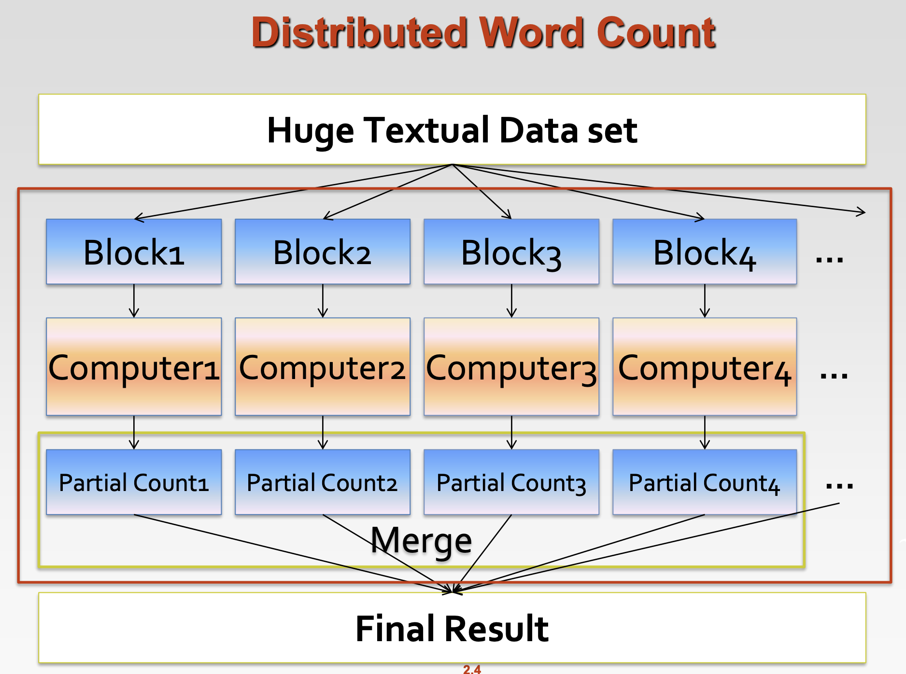

# **MapReduce**
## **Work Flow of Big Data Related**

When specify it in a Word Count task, the flow can be shown as the following figure.

***
## **What is MapReduce?**
* MapReduce is <u>Simplified Data Processing on Large Clusters</u>, origin from Google.
* It is a programming model for parallel data processing.
* Hadoop can run MapReduce programs written in various languages: Java, Ruby, Python, C++, etc.  
  Hadoop is something like a platform of MapReduce and other tools.
* Application: For large-scale data processing
  * Exploits large set of commodity computers
  * Executes process in a distributed manner
  * Offers high availability
***

## **Motivation for MapReduce**
### Typical Big Data problem challenges:
* How do we break up a large problem into smaller tasks that can
be executed in parallel?
* How do we assign tasks to workers distributed across a potentially
large number of machines?
* How do we ensure that the workers get the data they need?
* How do we coordinate synchronization among the different workers?
* How do we share partial results from one worker that is needed by another?
* How do we accomplish all of the above in the face of software errors and hardware faults?

Hence, there was need for an abstraction that hides many system-level details from the programmer.  
<u>MapReduce addresses this challenge by providing a simple
abstraction for the developer, transparently handling most of the details behind the scenes in a scalable, robust, and efficient manner.</u>
***

## **The idea of MapReduce**
Key idea: Provides a functional abstraction for **Map** and **Reduce** operations.
* Iterate over a large number of records  
* Extract something of interest from each ---- **Map Operation**
* Shuffle and sort intermediate result
* Aggregate intermediate results
* Generate final output (e.g. Merge data through pick up the maximum value) --- **Reduce Operation**